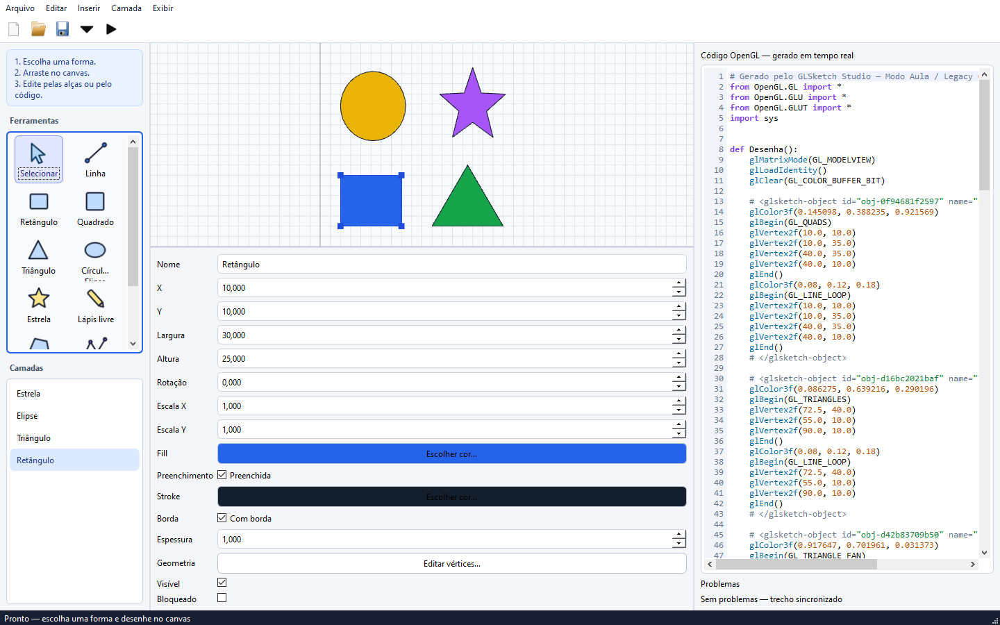

# GLSketch Studio

Editor visual 2D para desenhar de forma simples, como no Paint, enquanto o código Python/PyOpenGL é atualizado nos dois sentidos. Tanto o canvas quanto a exportação usam OpenGL imediato no estilo da disciplina.



## Recursos

- Canvas `QOpenGLWidget + PyOpenGL` com grid, snap, seleção, arrastar, resize, deformação por vértices, zoom e pan.
- Lápis livre, linha, retângulo, quadrado, triângulo, círculo/elipse, estrela, polígono e texto.
- Paleta visual com ícones próprios, atalhos e acabamento claro de editor gráfico.
- Preenchimento e borda opcionais, cores separadas e espessura configurável.
- Código Legacy OpenGL editável com sincronização bidirecional após debounce.
- Parser AST seguro, diagnósticos e preservação da última cena válida.
- Projetos JSON versionados em `.glsketch`.
- Exportação completa, função `Desenha()` ou seleção, com código limpo/marcado e coordenadas int/float.
- Preview GLUT controlável em subprocesso isolado.
- Layers, imagem de referência em textura OpenGL, undo/redo, clipboard e templates.

## Instalação mais fácil no Windows

### Sem instalar Python

Baixe `GLSketchStudio-Windows-x64.zip` na [Release v1.0.0](https://github.com/Soturine/glsketch-studio/releases/tag/v1.0.0), extraia a pasta e abra `GLSketchStudio.exe`.

### A partir do código-fonte

Com Python 3.12+ instalado, dê dois cliques em **`run-windows.cmd`**. Na primeira execução ele cria o ambiente isolado e instala automaticamente PySide6, PyOpenGL e as demais dependências. Depois, o mesmo arquivo abre o aplicativo imediatamente.

### Instalação manual no PowerShell

```powershell
py -m venv .venv
.venv\Scripts\Activate.ps1
python -m pip install -U pip
pip install hatchling editables
pip install .
python -m glsketch
```

No Prompt de Comando, ative com `.venv\Scripts\activate.bat`. Em Linux/macOS, use `python3 -m venv .venv`, `source .venv/bin/activate` e os mesmos comandos `pip`/`python`.

## Uso

1. Escolha uma forma e arraste no canvas; use `Shift` com retângulo/elipse para manter proporção.
2. Selecione para arrastar, redimensionar pela alça superior direita ou deformar pelos vértices.
3. Escolha preenchimento/borda e cores nas propriedades.
4. Veja o código à direita; altere `glColor3f`, `glVertex2f` ou transformações para atualizar o desenho.
5. Salve `.glsketch`, exporte `.py` ou abra o Preview OpenGL.

Código temporariamente inválido mostra diagnóstico sem apagar a cena. O parser nunca usa `eval`/`exec`.

Consulte [atalhos](docs/shortcuts.md), [arquitetura](docs/architecture.md), [sincronização](docs/bidirectional-sync.md), [OpenGL suportado](docs/supported-opengl.md), [gerador](docs/code-generator.md), [formato](docs/project-format.md) e [roadmap](docs/roadmap.md).

## Exemplos

- [Casa básica](examples/casa/README.md)
- [Formas básicas](examples/formas_basicas/README.md)
- [Lagoinha-SP](examples/lagoinha_sp/README.md) — estrutura vazia, aguardando referência oficial confirmada.

## Desenvolvimento

```powershell
pip install -e ".[dev]"
ruff check .
pytest
```

O código usa `src/glsketch`, com módulos separados para domínio, UI, geração, parsing, persistência e histórico. Veja [CONTRIBUTING.md](CONTRIBUTING.md).

Licenciado sob [MIT](LICENSE).
